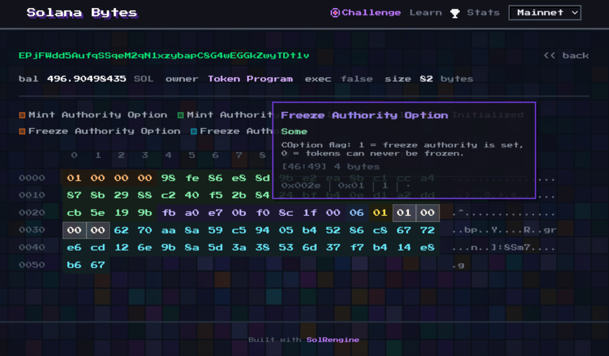

# Solana Bytes

**The byte-level field guide to Solana accounts.** Read any account's raw data as a color-coded, decoded hex dump, study the canonical byte layouts of every common account and instruction, or play the Byte Challenge to test your eye.

Live at **[bytes.solrengine.org](https://bytes.solrengine.org)** · available in **English and Spanish**. Built with [SolRengine](https://github.com/solrengine) and Rails 8 (originally for the Colosseum Frontier Hackathon, now a live product).



## Three ways in

1. **[Learn](https://bytes.solrengine.org/learn)** — a 52-page reference that decodes every common Solana account, instruction, and concept *byte by byte*. The thing you wish existed when you first stared at a raw account.
2. **Hex Visualizer** — paste any account address and see its live bytes color-coded and decoded, field by field.
3. **Byte Challenge** — a game: find a specific field in a hex dump, build streaks, climb the leaderboard.

## Learn — the byte-level reference

The flagship. **52 pages across 11 categories**, each with a one-line definition, a byte-layout table, common gotchas, links to the source program, and a real cached mainnet example:

| Category | Covers |
|---|---|
| **SPL Token** | Mint, Token Account, Multisig, instructions |
| **Token-2022** | Base layout + the TLV mechanism + all 15 extensions (transfer fees, interest, confidential transfers, metadata, hooks, …) |
| **Staking & Voting** | Stake Account, Vote Account |
| **Metaplex** | Token Metadata, Master/Print editions, delegate records |
| **Compressed NFTs** | Bubblegum tree config + leaf schema |
| **Transactions** | Legacy + v0 anatomy, compact-u16, signatures & blockhash, Address Lookup Tables |
| **Native instructions** | System, Compute Budget, Stake, Vote |
| **Programs** | BPF Upgradeable, ProgramData, Buffer, raw ELF |
| **Anchor** | Account + instruction discriminators, space & rent |
| **Addresses & PDAs** | PDA derivation, canonical bumps, ATAs |
| **Encoding** | COption vs Option vs OptionalNonZeroPubkey, Borsh vs bincode, rent & account size |

Content is plain **Markdown + YAML frontmatter** in [`content/learn/`](content/learn) — structural facts (offsets, sizes, program IDs) live in the base file; a `<slug>.<locale>.md` overlay carries only translated prose, so byte-level facts can never drift between languages. Canonical URLs are `/learn/<category>/<slug>`.

## Hex Visualizer

Paste any Solana account address and see its raw bytes as an interactive hex dump. Every byte range is color-coded and decoded — hover to see field names, values, and offsets. Decoders cover SPL Mints, Token Accounts, Token-2022 with extensions, Stake/Vote accounts, BPF programs (full ELF header), and more.

## Byte Challenge

An educational game: you're shown a hex dump and asked to find a specific field (e.g. "Mint Authority"). All cells start gray — click the right bytes. Build streaks, earn stars, compete on the leaderboard. 8-bit sound effects included. Guest play works; connect a wallet (Sign-In with Solana) to save results.

## Bilingual (English + Spanish)

The entire site is localized. English is the default at the bare path; Spanish lives under `/es` (e.g. `/es/learn/spl-token/mint`) with a language switcher in the nav and on the landing page. Untranslated areas fall back to English. Powered by Rails i18n with locale-in-path routing.

## Features

- Interactive hex dump with region decoding and hover tooltips
- 52-page bilingual byte-level reference (`/learn`)
- Byte Challenge game with streak mode, 3 lives, star ratings, 8-bit sound (Web Audio API)
- 8-bit pixel art design (Press Start 2P font, inline SVG pixel icons, pixel mosaic background)
- Wallet authentication via SIWS (SolRengine Auth Engine); guest play supported
- Leaderboard with top streaks (anti-cheat via signed challenge tokens)
- Network selector (mainnet, devnet, testnet)
- SPA navigation via Turbo Frames
- Content Security Policy, rate limiting, XSS protection
- 153 tests covering decoders, controllers, presenters, content loading, i18n, and game integrity

## Stack

- Ruby on Rails 8 (Hotwire, Turbo, Stimulus)
- [SolRengine](https://github.com/solrengine/solrengine) — Rails framework for Solana dapps
- [solrengine-rpc](https://github.com/solrengine/solrengine-rpc) — Solana JSON-RPC client
- [solrengine-auth](https://github.com/solrengine/solrengine-auth) — SIWS wallet authentication engine
- Tailwind CSS 4 + esbuild
- Kramdown (GFM) for the `/learn` reference content
- SQLite (via Solid Queue/Cache/Cable)
- Press Start 2P (self-hosted from `public/fonts/`)
- Sentry (error tracking), Rack::Attack (rate limiting), Ahoy (privacy-first analytics)
- Kamal for deploys

## Privacy & Analytics

We use Ahoy for self-hosted analytics. We log: country (geo-IP only, no IP stored), browser, OS, user_agent, referrer, and pageview events. We do **not** store IP addresses, precise location (city/lat/long), or set tracking cookies. Visit and event data are automatically purged after 90 days.

## Setup

```sh
bin/setup
cp .env.example .env
bin/dev
```

Open `http://localhost:3000`.

## Environment Variables

| Variable | Default | Description |
|---|---|---|
| `SOLANA_NETWORK` | `mainnet-beta` | Default network |
| `SOLANA_RPC_MAINNET_URL` | public RPC | Mainnet RPC endpoint |
| `SOLANA_RPC_DEVNET_URL` | public RPC | Devnet RPC endpoint |
| `SOLANA_RPC_TESTNET_URL` | public RPC | Testnet RPC endpoint |
| `APP_DOMAIN` | — | Domain for SIWS auth (production) |
| `SENTRY_DSN` | — | Sentry error tracking (production only) |

## Try These Accounts

| Address | What You'll See |
|---|---|
| `EPjFWdd5AufqSSqeM2qN1xzybapC8G4wEGGkZwyTDt1v` | USDC Mint — authority, supply, 6 decimals |
| `TokenkegQfeZyiNwAJbNbGKPFXCWuBvf9Ss623VQ5DA` | Token Program — full ELF header |
| `2b1kV6DkPAnxd5ixfnxCpjxmKwqjjaYmCZfHsFu24GXo` | PYUSD — Token-2022 with metadata + extensions |

## How It Works

### Learn reference

`AccountTaxonomy` loads the Markdown files in `content/learn/`, parsing YAML frontmatter for structure and rendering the body with Kramdown. For a non-default locale it overlays the matching `<slug>.<locale>.md` translation (name/summary/body only) on top of the canonical base file, falling back to English when no translation exists.

### Hex Visualizer

1. User pastes a Solana address
2. Server fetches the account via `solrengine-rpc` (`getAccountInfo` base64)
3. `AccountPresenter` decodes metadata + raw bytes into hex rows (O(1) offset lookup)
4. `RegionDecoder` identifies byte ranges by owner program (separate module)
5. Stimulus `hex-viewer` controller handles hover/tap highlighting and tooltips

### Byte Challenge

1. Random mainnet account loaded (SPL Mints + Token Accounts)
2. Random field selected as target (e.g. "Supply", "Mint Authority")
3. Server generates a signed challenge token carrying `streak`, `total_stars`, `user_id`, and `issued_at` (HMAC via Rails `MessageVerifier`)
4. All cells rendered gray — player clicks to guess
5. 3 wrong clicks = game over. Correct = streak +1, next challenge via signed token
6. Results saved to the leaderboard if connected via wallet. The save endpoint requires the token's `user_id` to match the authenticated user (no token donation), rejects tokens older than 10 minutes (no replay), and is idempotent via a SHA256 digest of the token (Turbo retries don't duplicate rows)

## Known Limitations

**Game integrity** — Challenge target answers are present in the rendered DOM (data attributes), and star ratings are computed client-side. A player with DevTools can solve any challenge instantly. The leaderboard is intended as social/educational, not competitive. A future version will move guess validation server-side via a signed-offset endpoint and remove the answer from the DOM.

**Partial Spanish coverage** — The reference, landing, About, Byte Challenge landing, leaderboard, stats, and navigation are fully translated. The live hex-viewer chrome, the in-game board, and the login page still fall back to English under `/es`.

## License

MIT
