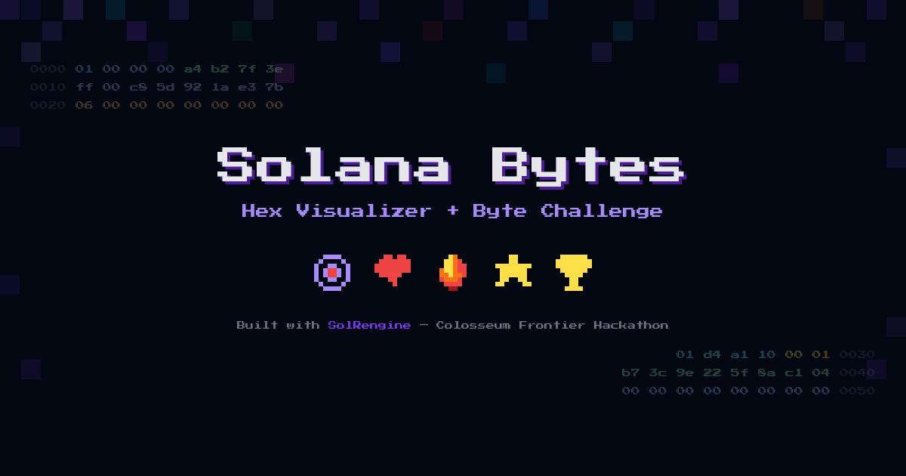

# Solana Bytes

An 8-bit pixel art Solana account hex visualizer and educational game. Visualize any account's raw data as a color-coded hex dump, or play the Byte Challenge to test your knowledge of Solana data structures.

Built with [SolRengine](https://github.com/solrengine) and Rails 8 for the **Colosseum Frontier Hackathon**.



## What It Does

**Hex Visualizer** — Paste any Solana account address and see its raw bytes as an interactive hex dump. Every byte range is color-coded and decoded: hover to see field names, values, offsets. Supports SPL Mints, Token Accounts, Token-2022 with extensions, BPF programs (full ELF header), and more.

**Byte Challenge** — An educational game where you're shown a hex dump and asked to find a specific field (e.g., "Mint Authority"). All cells start gray — you have to click the right bytes. Build streaks, earn stars, compete on the leaderboard. 8-bit sound effects included.

**Wallet Auth** — Connect your Solana wallet via Sign-In with Solana (SIWS) to save game results and appear on the leaderboard. Guest play works too.

## Features

- Interactive hex dump with region decoding and hover tooltips
- Byte Challenge game with streak mode, 3 lives, star ratings
- 8-bit pixel art design (Press Start 2P font, SVG pixel icons, pixel mosaic background)
- 8-bit sound effects (Web Audio API — correct, wrong, game over, start jingles)
- Wallet authentication via SIWS (SolRengine Auth Engine)
- Leaderboard with top streaks (anti-cheat via signed challenge tokens)
- Network selector (mainnet, devnet, testnet)
- SPA navigation via Turbo Frames
- Content Security Policy, rate limiting, XSS protection
- 29 tests covering decoders, base58 encoding, and game integrity

## Supported Account Types

| Account Type | Fields Decoded |
|---|---|
| **SPL Token Mint** | Mint authority, supply, decimals, freeze authority |
| **SPL Token Account** | Mint, owner, amount, delegate, state, close authority |
| **Token-2022** | Base fields + TLV extensions (metadata, transfer hook, etc.) |
| **BPF Upgradeable** | Account type, programdata address |
| **ELF Programs** | ELF header (class, endianness, machine, entry point, sections) |

## Stack

- Ruby on Rails 8 (Hotwire, Turbo, Stimulus)
- [SolRengine](https://github.com/solrengine/solrengine) — Rails framework for Solana dapps
- [solrengine-rpc](https://github.com/solrengine/solrengine-rpc) — Solana JSON-RPC client
- [solrengine-auth](https://github.com/solrengine/solrengine-auth) — SIWS wallet authentication engine
- Tailwind CSS 4 + esbuild
- SQLite (via Solid Queue/Cache/Cable)
- Press Start 2P (Google Fonts)
- Sentry (error tracking), Rack::Attack (rate limiting), Ahoy (privacy-first analytics)

## Setup

```sh
bin/setup
cp .env.example .env
bin/dev
```

Open `http://localhost:3000`.

## Environment Variables

| Variable | Default | Description |
|---|---|---|
| `SOLANA_NETWORK` | `mainnet-beta` | Default network |
| `SOLANA_RPC_MAINNET_URL` | public RPC | Mainnet RPC endpoint |
| `SOLANA_RPC_DEVNET_URL` | public RPC | Devnet RPC endpoint |
| `SOLANA_RPC_TESTNET_URL` | public RPC | Testnet RPC endpoint |
| `APP_DOMAIN` | — | Domain for SIWS auth (production) |
| `SENTRY_DSN` | — | Sentry error tracking (production only) |

## Try These Accounts

| Address | What You'll See |
|---|---|
| `EPjFWdd5AufqSSqeM2qN1xzybapC8G4wEGGkZwyTDt1v` | USDC Mint — authority, supply, 6 decimals |
| `TokenkegQfeZyiNwAJbNbGKPFXCWuBvf9Ss623VQ5DA` | Token Program — full ELF header |
| `2b1kV6DkPAnxd5ixfnxCpjxmKwqjjaYmCZfHsFu24GXo` | PYUSD — Token-2022 with metadata + extensions |

## How It Works

### Hex Visualizer

1. User pastes a Solana address
2. Server fetches account via `solrengine-rpc` (`getAccountInfo` base64)
3. `AccountPresenter` decodes metadata + raw bytes into hex rows (O(1) offset lookup)
4. `RegionDecoder` identifies byte ranges by owner program (separate module)
5. Stimulus `hex-viewer` controller handles hover/tap highlighting and tooltips (indexed by region)

### Byte Challenge

1. Random mainnet account loaded (SPL Mints + Token Accounts)
2. Random field selected as target (e.g., "Supply", "Mint Authority")
3. Server generates a signed challenge token (prevents streak spoofing)
4. All cells rendered gray — player clicks to guess
5. Hover shows "?????" as field name + decoded value (educational)
6. 3 wrong clicks = game over. Correct = streak +1, next challenge via signed token
7. Results saved to leaderboard if connected via wallet (server-verified)

## License

MIT
